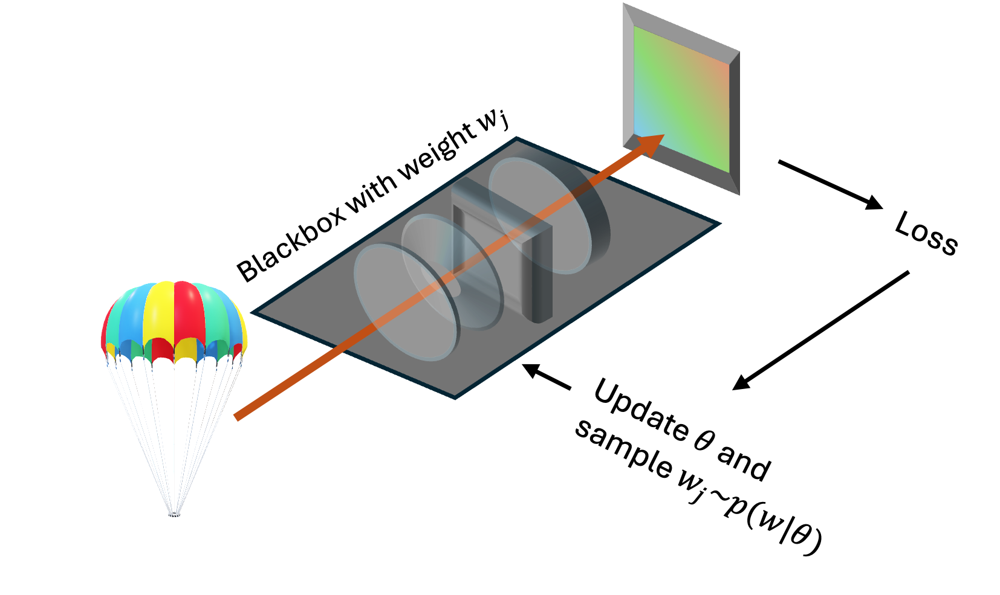

# Model-free-Computational-Optics
This repo is an opensource library for **model-free computational optics**. 

Model-freee optimization optimizes the optical system $f_{sys}(x, w)$ without requiring an explicit model $\hat{f}_{sys}(x, w)$

<p align="center"></p>

### Related Paper

**High-performance real-world optical computing trained by in situ gradient-based model-free optimization**

*ICCP&TPAMI 2024*

[Project page](https://shuxin626.github.io/mfo_optical_computing/index.html) | [Arxiv](https://arxiv.org/abs/2307.11957)

[Guangyuan Zhao](https://zhaoguangyuan123.github.io), [Xin Shu](), [Renjie Zhou](https://www.renjiezhou.com/)


### How to use

1. **Clone this repo**

2. **Choose an optimization method for training** in `param/param_classification.py`:
    ```python
    settings['optimizer'] = 'mfo' # our method
    settings['optimizer'] = 'sbt' # simulator-based method
    settings['optimizer'] = 'hbt' # hybrid training method
    ```

3. **Start training**

   ```bash
   python main_onn.py
   ```

4. **Set parameters for testing** in `param/param_classification.py`:

    ```python
    settings['train_or_test'] = 'test'
    test_param['ckpt_dir] = YOUR_CHECKPOINT_DIR
    ```

5. **Start testing**

    ```bash
    python main_onn.py
    ```

### Citation

If you find our work useful, please cite our paper:
```bibtex
@article{zhao2023modelfreeopticalcomputing,
  title={High-performance real-world optical computing trained by in situ model-free optimization},
  author={Zhao, Guangyuan and Shu, Xin and Zhou, Renjie},
  journal={arXiv preprint arXiv:2307.11957},
  year={2023}
}
```
