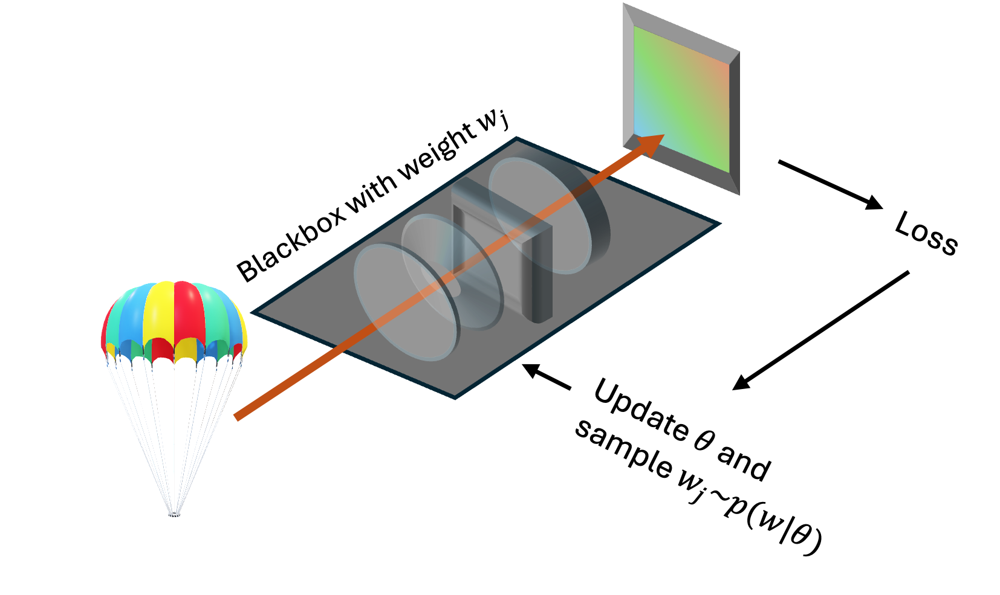
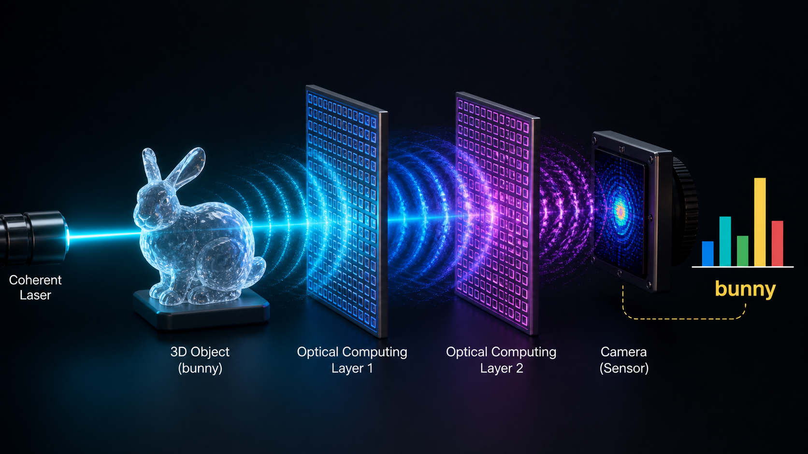
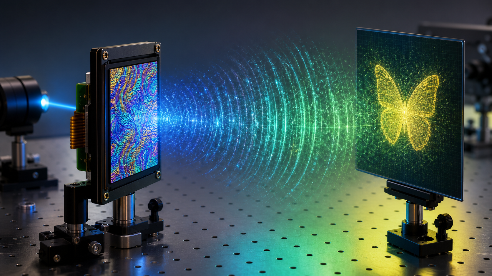

# Model-free-Computational-Optics
This repo is an opensource library for **model-free computational optics**.

Model-free optimization optimizes the optical systems $f_{sys}(x, w)$ without requiring explicit numerical models $\hat{f}_{sys}(x, w)$.

<p align="center"></p>

### 1. Computational Optics Optimization Paradigms

| Paradigm | Uses | Strength | Cost |
| --- | --- | --- | --- |
| <span style="color:#f2f2f2">●</span> **Whitebox** | Differentiable simulator | Fast gradients; easy ablations | Simulator-real gap |
| <span style="color:#8a8f98">●</span> **Graybox** | Partial model + calibration | Uses physics and measurements | Calibration burden |
| <span style="color:#111111">●</span> **Blackbox / model-free** | Real system as oracle | Direct in-situ optimization | More hardware queries |

### 2. This repo contains the following tasks:

| Optical computing | Computer-generated holography |
| --- | --- |
|  |  |

The task illustrations are AI-generated assets. The prompts and OpenAI API script are in [utils/generate_readme_aigc_task_images.py](utils/generate_readme_aigc_task_images.py).

#### - MFO for Optical Computing
High-performance real-world optical computing trained by in situ gradient-based model-free optimization

🏆 <span style="color:magenta">Best paper award of ICCP 2024</span>

*ICCP&TPAMI 2024* | [Project page](https://shuxin626.github.io/mfo_optical_computing/index.html) | [Arxiv](https://arxiv.org/abs/2307.11957) |
[Guangyuan Zhao](https://zhaoguangyuan123.github.io), [Xin Shu](), [Renjie Zhou](https://www.renjiezhou.com/)


#### - MFO for Computer-Generated Holography
Model-free computer generated holography
Zhao, Guangyuan, and Renjie Zhou. TENCON 2022-2022 IEEE Region 10 Conference (TENCON). IEEE, 2022.


### 3. Run details

See [docs/details.md](docs/details.md) for optical computing, two-layer simulator, testing, and naive CGH run instructions.

### 4. TODO

- [x] Further refactor repo.
- [x] Add detailed simulator-based two-layer optical computing code.
- [x] Add CGH run code.
- [ ] In construction.


### 5. Citation

If you find our work useful, please cite our paper:

```bibtex
@article{zhao2024high,
  title={High-performance real-world optical computing trained by in situ gradient-based model-free optimization},
  author={Zhao, Guangyuan and Shu, Xin and Zhou, Renjie},
  journal={IEEE Transactions on Pattern Analysis and Machine Intelligence},
  year={2024},
  publisher={IEEE}
}
```
```bibtex
@inproceedings{zhao2022model,
  title={Model-free computer-generated holography},
  author={Zhao, Guangyuan and Zhou, Renjie},
  booktitle={TENCON 2022-2022 IEEE Region 10 Conference (TENCON)},
  pages={1--3},
  year={2022},
  organization={IEEE}
}
```
